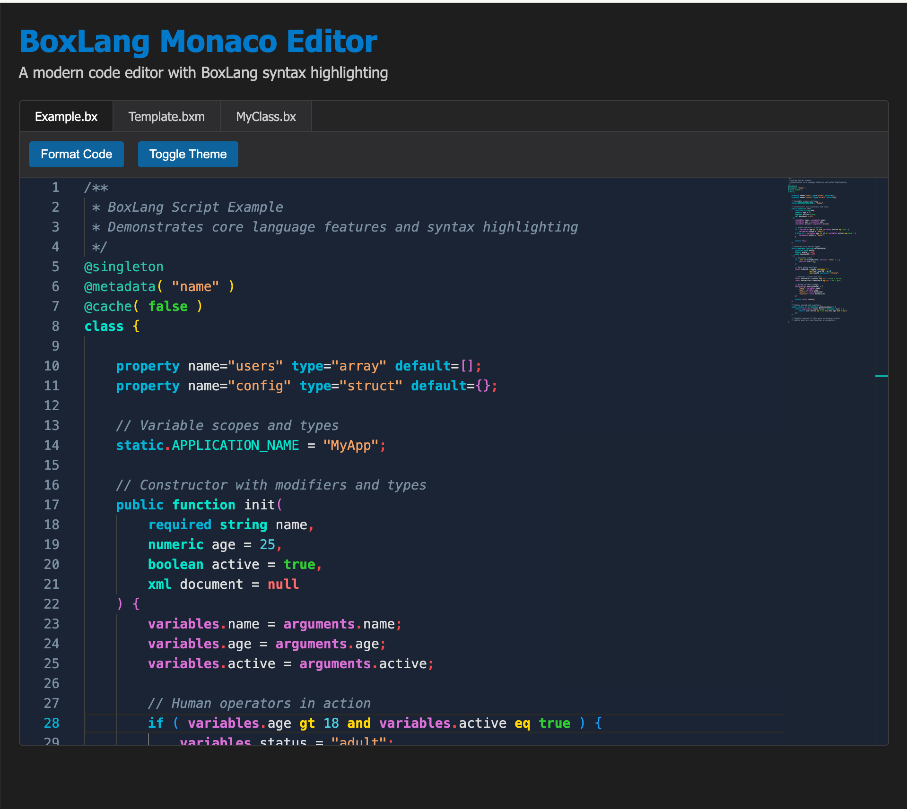
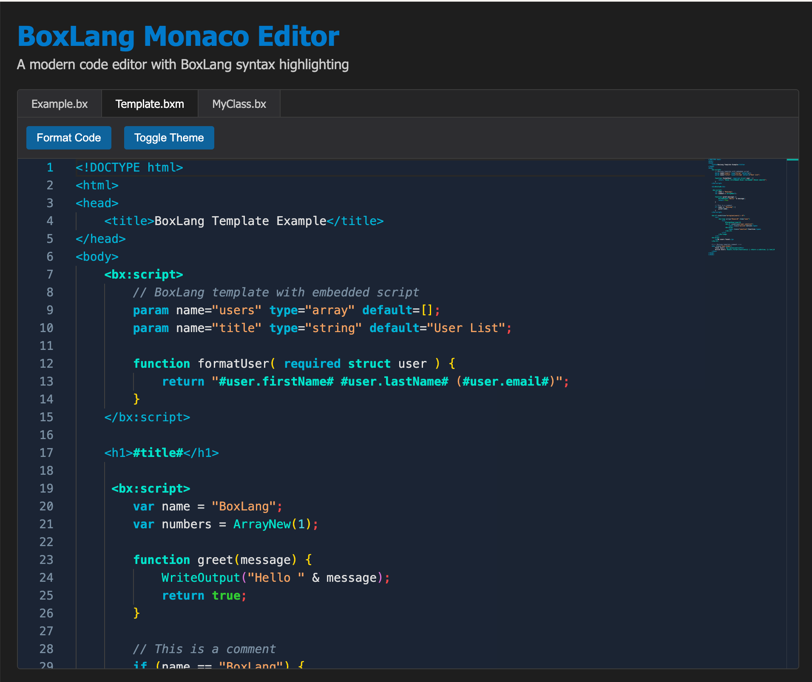

# boxlang-monaco-editor

Monaco Editor language support for BoxLang - providing syntax highlighting, IntelliSense, and custom themes for BoxLang development.

Built with [Vite](https://vitejs.dev/) for fast development and optimized production builds.

[](https://www.npmjs.com/package/boxlang-monaco-editor)
[](https://opensource.org/licenses/Apache-2.0)

## Table of Contents

- [Screenshots](#screenshots)
- [Installation](#installation)
- [Quick Start](#quick-start)
- [Features](#features)
- [API Reference](#api-reference)
- [Development](#development)
- [File Structure](#file-structure)
- [Integration Guide](#integration-guide)
- [Supported Features](#supported-features)
- [Customization](#customization)
- [Contributing](#contributing)
- [Browser Support](#browser-support)
- [Changelog](#changelog)
- [License](#license)

## Screenshots

### BoxLang Script Syntax Highlighting



### BoxLang Template Syntax Highlighting



## Installation

```bash
npm install boxlang-monaco-editor monaco-editor
```

## Quick Start

```javascript
import * as monaco from 'monaco-editor';
import { initializeBoxLangSupport, createBoxLangEditor } from 'boxlang-monaco-editor';

// Initialize BoxLang support
initializeBoxLangSupport();

// Create a BoxLang editor
const editor = createBoxLangEditor(document.getElementById('editor'), {
    value: 'class { function init() { return this; } }',
    language: 'boxlang',
    theme: 'boxlang-theme'
});
```

## Features

- **Syntax Highlighting**: Full support for BoxLang script (.bx, .bxs) and template (.bxm) files
- **IntelliSense**: Auto-completion for BoxLang keywords, functions, and constructs
- **Custom Theme**: BoxLang-branded color theme featuring the signature cyan-blue gradient from the official logo
- **Template Support**: Mixed HTML/BoxLang template highlighting
- **Code Folding**: Intelligent folding for functions, classes, and blocks
- **Bracket Matching**: Automatic bracket and quote pairing

## API Reference

### Core Functions

#### `initializeBoxLangSupport()`
Initializes BoxLang language support in Monaco Editor. This registers the language, sets up syntax highlighting, and applies the theme.

```javascript
import { initializeBoxLangSupport } from 'boxlang-monaco-editor';
initializeBoxLangSupport();
```

#### `createBoxLangEditor(container, options)`
Creates a Monaco Editor instance configured for BoxLang.

**Parameters:**
- `container` (HTMLElement): DOM element to host the editor
- `options` (Object): Monaco Editor configuration options

**Returns:** Monaco Editor instance

```javascript
import { createBoxLangEditor } from 'boxlang-monaco-editor';

const editor = createBoxLangEditor(document.getElementById('editor'), {
    value: 'component { function init() { return this; } }',
    language: 'boxlang',
    theme: 'boxlang-theme',
    automaticLayout: true
});
```

#### `getBoxLangLanguage()`
Returns the registered BoxLang language configuration.

```javascript
import { getBoxLangLanguage } from 'boxlang-monaco-editor';
const language = getBoxLangLanguage();
```

### Constants

#### Language IDs
- `BOXLANG_LANGUAGE_ID`: `'boxlang'` - For script files (.bx, .bxs)
- `BOXLANG_TEMPLATE_LANGUAGE_ID`: `'boxlang-template'` - For template files (.bxm)

#### File Extensions
- `BOXLANG_EXTENSIONS`: `['.bx', '.bxs']` - BoxLang script file extensions
- `BOXLANG_TEMPLATE_EXTENSIONS`: `['.bxm']` - BoxLang template file extensions

#### MIME Types
- `BOXLANG_MIME_TYPES`: `['text/x-boxlang']`
- `BOXLANG_TEMPLATE_MIME_TYPES`: `['text/x-boxlang-template']`

### Individual Components

If you need more control, you can import and configure individual components:

```javascript
import { boxlangLanguageConfig } from 'boxlang-monaco-editor';
import { boxlangMonarchTokens } from 'boxlang-monaco-editor';
import { boxlangTheme } from 'boxlang-monaco-editor';

// Manual setup
monaco.languages.register({ id: 'boxlang' });
monaco.languages.setLanguageConfiguration('boxlang', boxlangLanguageConfig);
monaco.languages.setMonarchTokensProvider('boxlang', boxlangMonarchTokens.script);
monaco.editor.defineTheme('boxlang-theme', boxlangTheme);
```

## Development

1. **Install dependencies**:

   ```bash
   npm install
   ```

2. **Start development server**:

   ```bash
   npm run dev
   ```

   This will start Vite's development server at http://localhost:3000 with hot module replacement for fast development.

3. **Build library for production**:

   ```bash
   npm run build
   ```

   This builds the library for production using Rollup.

4. **Preview production build**:

   ```bash
   npm run preview
   ```

   This serves the demo locally for testing. Note: The demo is for development purposes only and doesn't produce a production build.

## File Structure

```text
boxlang-monaco-editor/
├── src/
│   ├── demo/
│   │   ├── index.html          # Demo page
│   │   └── index.js            # Demo application
│   ├── index.js                # Main library entry point
│   ├── boxlang-language-config.js   # Language configuration
│   ├── boxlang-monarch-tokens.js    # Syntax tokenizer
│   └── boxlang-theme.js        # Custom color theme
├── dist/                       # Production build output
├── package.json
├── vite.config.js              # Vite configuration
└── rollup.config.js           # Rollup config for library builds
```

## Integration Guide

### Basic Setup

To integrate BoxLang support into your own Monaco Editor instance:

```javascript
import * as monaco from "monaco-editor";
import { boxlangLanguageConfig } from "boxlang-monaco-editor/boxlang-language-config";
import { boxlangMonarchTokens } from "boxlang-monaco-editor/boxlang-monarch-tokens";
import { boxlangTheme } from "boxlang-monaco-editor/boxlang-theme";

// Register BoxLang language
monaco.languages.register( { id: "boxlang" } );
monaco.languages.register( { id: "boxlang-template" } );

// Set language configuration
monaco.languages.setLanguageConfiguration( "boxlang", boxlangLanguageConfig );
monaco.languages.setLanguageConfiguration( "boxlang-template", boxlangLanguageConfig );

// Set syntax highlighting
monaco.languages.setMonarchTokensProvider( "boxlang", boxlangMonarchTokens.script );
monaco.languages.setMonarchTokensProvider( "boxlang-template", boxlangMonarchTokens.template );

// Define custom theme
monaco.editor.defineTheme( "boxlang-theme", boxlangTheme );

// Create editor
const editor = monaco.editor.create( document.getElementById( "container" ), {
    value: "component { function init() { return this; } }",
    language: "boxlang",
    theme: "boxlang-theme"
} );
```

### File Extension Mapping

Configure your application to map file extensions to the appropriate language:

```javascript
function getLanguageForFile( filename ) {
    const ext = filename.split( "." ).pop().toLowerCase();
    switch ( ext ) {
        case "bx":
        case "bxs":
            return "boxlang";
        case "bxm":
            return "boxlang-template";
        default:
            return "plaintext";
    }
}
```

### Custom Completion Provider

The integration includes a basic completion provider. You can extend it with your own completions:

```javascript
monaco.languages.registerCompletionItemProvider( 'boxlang', {
    provideCompletionItems: function( model, position ) {
        // Your custom completion logic here
        return {
            suggestions: [
                {
                    label: 'myCustomFunction',
                    kind: monaco.languages.CompletionItemKind.Function,
                    insertText: 'myCustomFunction( $1 )',
                    insertTextRules: monaco.languages.CompletionItemInsertTextRule.InsertAsSnippet,
                    documentation: 'My custom function'
                }
            ]
        };
    }
});
```

## Supported Features

### BoxLang Script Files (.bx, .bxs)

- Component declarations
- Function definitions
- Class syntax with inheritance
- Interface definitions
- Property declarations
- Annotations (@inject, @cacheable, etc.)
- Control flow (if/else, loops, switch)
- Exception handling (try/catch/finally)
- Variable declarations and scoping
- Operators and expressions

### BoxLang Template Files (.bxm)

- HTML markup
- BoxLang script blocks (`<bx:script>`)
- BoxLang components (`<bx:if>`, `<bx:loop>`, etc.)
- String interpolation (`#variable#`)
- BoxLang comments (`<!--- comment --->`)
- Mixed HTML/BoxLang syntax

## Customization

### Themes

You can create custom themes by extending the base theme:

```javascript
const myCustomTheme = {
    base: 'vs-dark',
    inherit: true,
    rules: [
        { token: 'keyword', foreground: 'ff0000' },
        // Add your custom rules
    ],
    colors: {
        'editor.background': '#1a1a1a',
        // Add your custom colors
    }
};

monaco.editor.defineTheme('my-custom-theme', myCustomTheme);
```

### Language Configuration

Modify `boxlang-language-config.js` to customize:

- Comment styles
- Bracket pairs
- Auto-closing pairs
- Folding rules
- Indentation rules

### Syntax Highlighting

Update `boxlang-monarch-tokens.js` to add or modify:

- Keywords
- Operators
- Token patterns
- Syntax rules

## Development

### Testing Changes

1. Make your changes to the source files
2. Run `npm run dev` to start the Vite development server
3. Open http://localhost:3000 to test your changes
4. The page will automatically reload when you save changes thanks to Vite's fast HMR (Hot Module Replacement)

### Adding New Keywords

To add new BoxLang keywords:

1. Edit `boxlang-monarch-tokens.js`
2. Add the keyword to the `keywords` array
3. If it's a type keyword, also add it to `typeKeywords`
4. Test the highlighting in the demo

## Troubleshooting

### Common Issues

**Q: Monaco Editor shows "Language 'boxlang' is not configured" error**

A: Make sure you call `initializeBoxLangSupport()` before creating the editor:

```javascript
import { initializeBoxLangSupport } from 'boxlang-monaco-editor';
initializeBoxLangSupport(); // Call this first
// Then create your editor
```

**Q: Syntax highlighting doesn't work**

A: Verify the language is set correctly when creating the editor:

```javascript
const editor = monaco.editor.create(container, {
    value: 'your code',
    language: 'boxlang', // For .bx/.bxs files
    // OR
    language: 'boxlang-template' // For .bxm files
});
```

**Q: Custom theme not applied**

A: Ensure the theme is set after initialization:

```javascript
initializeBoxLangSupport();
monaco.editor.setTheme('boxlang-theme');
```

**Q: TypeScript errors when importing**

A: The package includes TypeScript definitions. If you encounter issues, try:

```typescript
import type { BoxLangMonacoEditor } from 'boxlang-monaco-editor';
// OR
import * as BoxLangMonaco from 'boxlang-monaco-editor';
```

### Performance Tips

- Use `automaticLayout: true` for responsive editors
- Consider lazy loading for large applications
- Use `tokenization.colorValidation: false` for better performance with many colors

## Contributing

We welcome contributions! Here's how you can help:

### Reporting Issues

- Use the [GitHub issue tracker](https://github.com/ortus-boxlang/boxlang-monaco-editor/issues)
- Include a clear description and steps to reproduce
- Provide code samples when possible
- Mention your browser and Monaco Editor version

### Development Setup

1. Fork the repository
2. Clone your fork: `git clone https://github.com/YOUR_USERNAME/boxlang-monaco-editor.git`
3. Install dependencies: `npm install`
4. Start development server: `npm run dev`
5. Make your changes
6. Test thoroughly using the demo at `http://localhost:3000`
7. Run linting: `npm run lint`
8. Create a pull request

### Areas for Contribution

- **New Language Features**: Add support for additional BoxLang syntax
- **Theme Improvements**: Enhance the color scheme or add new themes
- **IntelliSense**: Expand autocompletion with more BoxLang functions
- **Performance**: Optimize tokenization and parsing
- **Documentation**: Improve examples and API documentation
- **Testing**: Add unit tests and integration tests

### Code Style

- Follow the existing ESLint configuration
- Use meaningful commit messages
- Add JSDoc comments for new functions
- Update README for new features

## License

Apache 2.0 - see the [LICENSE](LICENSE) file for details.

## Related Projects

- [BoxLang](https://boxlang.io) - The BoxLang programming language
- [Monaco Editor](https://microsoft.github.io/monaco-editor/) - The code editor that powers VS Code
- [TextMate](https://macromates.com) - The original editor supporting TextMate grammars
